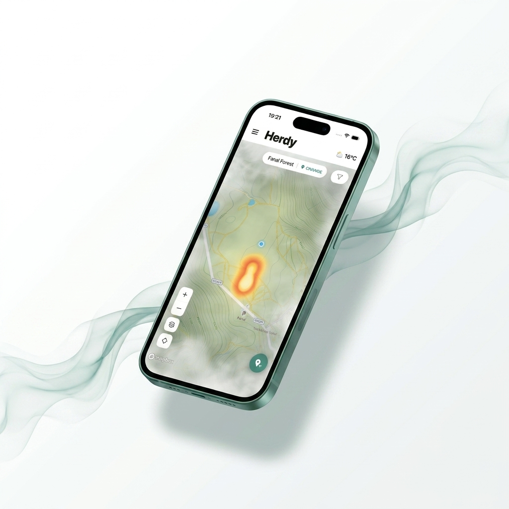
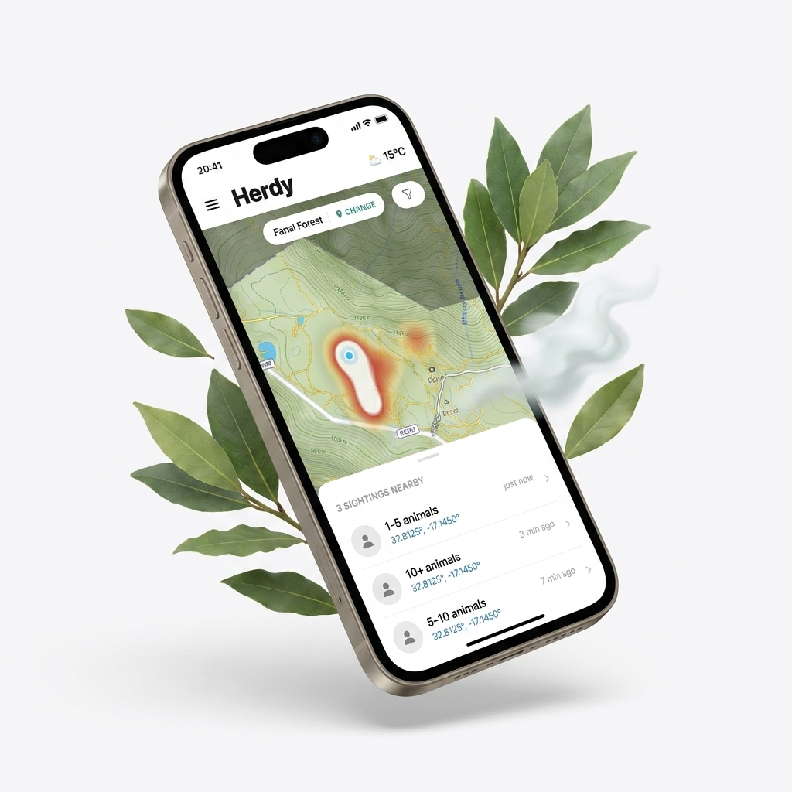
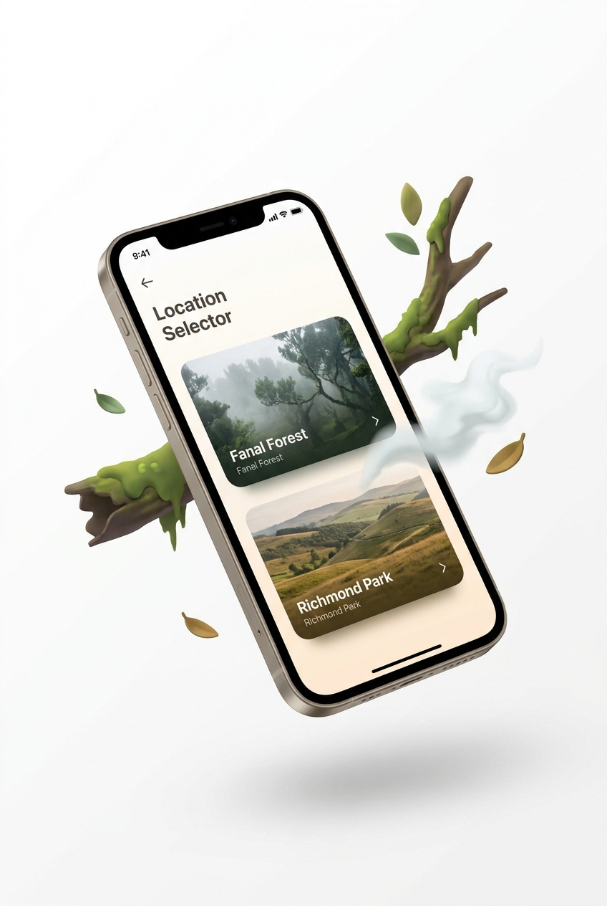

# Herdy 🐄

**A crowdsourced, time-decaying wildlife heatmap for wild-herd trails — starting with the Fanal Forest cattle in Madeira.**

Visitors drop a one-tap, anonymous pin when they spot the herd. Pins aggregate into a soft "fog cloud" heatmap that decays over ~4 hours, so the cloud naturally drifts as the herd moves — no exact GPS markers, no accounts, no tracking.

<p align="center">
  
  
  
</p>

## What it does

- **Live heatmap** — active sightings rendered as a blurred, weighted heatmap cloud (Mapbox), not individual pin drops
- **Time decay** — every pin loses weight client-side over 4 hours and drops off the map entirely once stale, so the map always reflects "now," not "ever"
- **Proximity nudges** — a local notification when you're near the weighted centroid of recent activity, paired with responsible-viewing copy
- **Offline-first trail** — the trail route is bundled as a local GeoJSON asset so it renders immediately, even with no signal
- **Multi-location** — Fanal Forest (Madeira) live today, more trail locations designed to slot in without new app releases
- **No accounts** — every pin is anonymous; there is nothing to sign up for and nothing tying a pin to a person

## Responsible by design

Fanal Forest is a UNESCO World Heritage laurel forest under active conservation management. The app is built around that constraint, not against it:

- No precise pin markers — only the blurred heatmap cloud (~80–120m intentional blur)
- The map only surfaces the official trail as walkable — the open plateau is never presented as a route
- Proximity notifications always append: *"Stay on the path · Keep voices low · Give the herd space."*
- No GPS coordinates are ever written to the database — only anonymised pin drops

*This is an independent personal project and is not affiliated with, endorsed by, or operated on behalf of any park authority or conservation body.*

## Tech stack

| Concern | Choice |
|---|---|
| App framework | React Native — Expo (managed workflow) |
| Language | TypeScript |
| Map | [`@rnmapbox/maps`](https://github.com/rnmapbox/maps) — heatmap layer, offline tiles, GeoJSON trail overlay |
| Backend | Firebase Firestore (real-time `onSnapshot`), Firebase Storage |
| Build & distribution | EAS (`eas build`, `eas submit`) |
| Auth | None — anonymous by design |

## Getting started

### Prerequisites
- Node.js (LTS) and npm
- [Expo CLI](https://docs.expo.dev/get-started/installation/) (`npx expo`, no global install needed)
- A free [Mapbox](https://www.mapbox.com/) account (public token + a secret downloads token for native builds)
- A [Firebase](https://firebase.google.com/) project (Firestore + Storage enabled)
- Xcode / Android Studio only if you want to run a native build locally — day-to-day dev just needs Expo Go / a dev client

### 1. Clone and install
```bash
git clone https://github.com/hotDoggey/herdy.git
cd herdy
npm install
```
This project targets the Expo managed workflow — new native dependencies should be added with `npx expo install <package>`, not `npm install`, so versions stay aligned with the installed Expo SDK.

### 2. Configure environment variables
```bash
cp .env.example .env
```
Fill in `.env` with your own values:
- `EXPO_PUBLIC_FIREBASE_*` — from your Firebase project settings (Web app config)
- `EXPO_PUBLIC_MAPBOX_TOKEN` — your Mapbox **public** token
- `RNMAPBOX_MAPS_DOWNLOAD_TOKEN` — your Mapbox **secret** downloads token (only needed to build the native shell, not for JS-only dev)

### 3. Set up Firebase
- Enable **Firestore** and **Storage** in your Firebase project
- Deploy the included rules/indexes:
  ```bash
  firebase deploy --only firestore:rules,firestore:indexes
  ```
- Firestore security rules (`firestore.rules`) validate every pin write server-side (schema, timestamp window, known location IDs) and deny all edits/deletes — no data is ever mutated after creation

### 4. Run it
```bash
npm start          # Metro bundler — scan the QR code with a dev client / Expo Go
```
Mapbox requires a native module, so a plain Expo Go session won't render the map. Build a dev client once, then iterate with hot reload:
```bash
npx expo run:ios --device      # or: eas build --profile development
```

## Project structure
```
/app          Expo Router screens (map, feed, onboarding, settings, sighting detail)
/components   Heatmap layer, pin-drop sheet, proximity banner, location picker
/hooks        Firestore live sync, location, proximity detection
/lib          Firebase init, Firestore helpers, geo math, decay logic
/constants    Per-location config (bounding box, trail center, decay window)
/assets       Bundled offline trail GeoJSON, icons, onboarding imagery
```

See [`herdy-mvp.md`](herdy-mvp.md) for the full product/technical spec this build follows.
